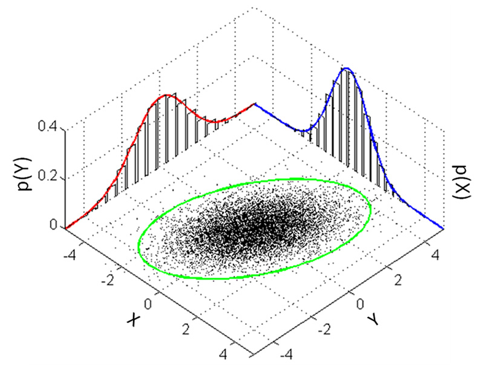

# 3D Gaussian Splatting

## main idea
输入静态场景的图像集，使用SFM方法的COLMAP校准的相机构建点云，为每一个点提供一个初始的3d gaussian 每个3D Gaussian包含一系列可优化的参数包括gaussian的均值，球谐系数等，给定相机视角，将3D Gaussian投影到2D平面上。再对其和真是的图像计算loss进行优化

为了应对欠重建和过重建，在训练期间还会每隔一定间隔，对那些均值self._xyz的梯度超过一定阈值且尺度小于一定阈值的3D gaussian进行克隆操作，对于那些均值self._xyz的梯度超过一定阈值且尺度大于一定阈值的3D gaussian进行分割操作，并将opacity小于一定阈值的3D gaussians进行删除

## 3D Gaussian

### 特点
    1. 相较于Nerf使用隐式建模的方法，使用3D Gaussian作为显示建模的primitive，可以走光栅化管线
    2. 3D Gaussian可以作为小型可微空间进行优化，不同3D Gaussian则能够像三角形一样并行光栅化渲染，可以看成是在可微和离散之间做了一个微妙平衡。

### 表示
通过$\mu$和协方差矩阵$\Sigma$来控制3D Gaussian椭球的中心点位置和椭球的三轴向的伸缩和旋转

Example：
    一维正态分布的概率密度函数为
    $$
    f(x)=\frac{1}{\sqrt{2 \pi} \sigma} \exp \left(-\frac{(x-\mu)^{2}}{2 \sigma^{2}}\right)
    $$
    其均值为$\mu$控制其图像位置，方差$\sigma^2$控制其图像的宽度，大部分数据落在$[\mu-3\sigma, \mu+3\sigma]$区间内，因此可以说$\mu$和$\sigma$可以确定一条线段$[\mu-3\sigma, \mu+3\sigma]$
    二维正态分布的概率密度函数为
    $$
    f(x, y)=\frac{1}{2 \pi \sigma_{x} \sigma_{y} \sqrt{1-\rho^{2}}} \exp \left(-\frac{1}{2(1-\rho^{2})}\left[\frac{(x-\mu_{x})^{2}}{\sigma_{x}^{2}}+\frac{(y-\mu_{y})^{2}}{\sigma_{y}^{2}}-\frac{2 \rho(x-\mu_{x})(y-\mu_{y})}{\sigma_{x} \sigma_{y}}\right]\right)
    $$
    其中$\rho$为相关系数，$\sigma_x$和$\sigma_y$分别为$x$和$y$的标准差，$\mu_x$和$\mu_y$分别为$x$和$y$的均值，$\sigma_x^2$和$\sigma_y^2$分别为$x$和$y$的方差，$\sigma_x\sigma_y$为$x$和$y$的协方差
    

```python
class GaussianModel:
    def __init__(self, sh_degree:int):
        self.active_sh_degree = 0
        self.max_sh_degree = sh_degree  
        self._xyz = torch.empty(0)                           # 中心点位置, 也即3Dgaussian的均值
        self._features_dc = torch.empty(0)                   # 第一个球谐系数, 球谐系数用来表示RGB颜色
        self._features_rest = torch.empty(0)                 # 其余球谐系数
        self._scaling = torch.empty(0)                       # 尺度
        self._rotation = torch.empty(0)                      # 旋转参数, 使用四元数，四元数相比旋转矩阵，容易进行插值
        self._opacity = torch.empty(0)                       # 不透明度
        self.max_radii2D = torch.empty(0)                    # 投影到2D时, 每个2D gaussian最大的半径
        self.xyz_gradient_accum = torch.empty(0)             # 3Dgaussian的均值的累积梯度
        self.denom = torch.empty(0)
        self.optimizer = None                                # 上述各参数的优化器
        self.percent_dense = 0
        self.spatial_lr_scale = 0
        self.setup_functions()
```

### 初始化3D Gaussian
3D Gaussian对$\Sigma$的基本要求是半正定，因此从数值角度不好入手，直接从几何上手。由于3D Gaussian同构于椭球，只需对球进行基础的拉伸（轴向）旋转变化即可，所以
$$\Sigma = RSS^TR^T$$
由于放缩变换都是沿着坐标轴，所以只需要一个3D向量$s$，旋转则用四元数$q$表达

```python
class GaussianModel:
    def setup_functions(self):
        # 从尺度和旋转参数中去构建3Dgaussian的协方差矩阵
        def build_covariance_from_scaling_rotation(scaling, scaling_modifier, rotation):
            L = build_scaling_rotation(scaling_modifier * scaling, rotation)
            actual_covariance = L @ L.transpose(1, 2)
            symm = strip_symmetric(actual_covariance)
            return symm

        self.scaling_activation = torch.exp                  # 将尺度限制为非负数
        self.scaling_inverse_activation = torch.log

        self.covariance_activation = build_covariance_from_scaling_rotation

        self.opacity_activation = torch.sigmoid              # 将不透明度限制在0-1的范围内
        self.inverse_opacity_activation = inverse_sigmoid

    def build_scaling_rotation(s, r):
        L = torch.zeros((s.shape[0], 3, 3), dtype=torch.float, device="cuda")
        R = build_rotation(r)

        L[:,0,0] = s[:,0]
        L[:,1,1] = s[:,1]
        L[:,2,2] = s[:,2]

        L = R @ L
        return L

    def strip_symmetric(sym):
        return strip_lowerdiag(sym)

    def strip_lowerdiag(L):
        uncertainty = torch.zeros((L.shape[0], 6), dtype=torch.float, device="cuda")

        uncertainty[:, 0] = L[:, 0, 0]
        uncertainty[:, 1] = L[:, 0, 1]
        uncertainty[:, 2] = L[:, 0, 2]
        uncertainty[:, 3] = L[:, 1, 1]
        uncertainty[:, 4] = L[:, 1, 2]
        uncertainty[:, 5] = L[:, 2, 2]
        return uncertainty
```

在自适应优化中生成新椭球：
    continue...

### splatting原理以及基于GPU的快速可微渲染

#### 矩阵变换
先使用view变换到相机空间，再使用project变换到透视空间进行光栅化

因为3D Gaussian是一个3D分布，我们希望他在进行变换中继续保持这个分布，view变换是仿射变换，对其没有影响，但是project变换不能保证，因此在论文中使用$J$来对project进行仿射近似

#### 3D to 2D

#### 光栅化
1. 将整个图像划分为16*16个tiles，每个tile视锥内挑选可视的3D Gaussian
2. 每个视锥内只取执行度大于99%的Gaussian，并将3D Gaussian实例化为高斯对象，并按对象中包含的深度信息排序
3. 并行地splatting
4. 当像素不透明度达到饱和就停止对应线程
5. 反向传播误差时按tile对高斯进行索引

submodules/diff-gaussian-rasterization
forward.cu
    1.对每个gaussian进行预处理，得到其半径以及覆盖了哪些tile
    2.对每一个tile，使用splatting技术渲染
continue...

## optimization

## 3D gaussian for physics-based rendering

mpm