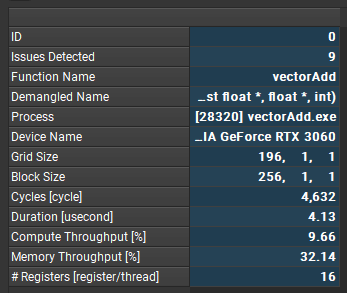
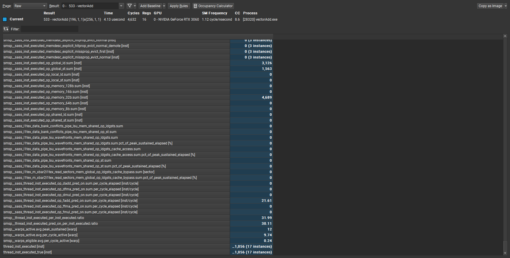

# nsight compute

报告所用exe由cuda-samples-11.8的vectorAdd项目生成

## Summary

Cycles：在GPU上执行的周期数
Compute Throughput：
Memory Throughput:
Registers：Number of registers allocated per thread

## Details

### GPU Speed Of Light Throughput

### Compute Workload Analysis

### Memory Workload Analysis

### Scheduler Statistics

### Occupancy Analysis

### Warp State Statistics

### Instruction Statistics

### NVLink Topology

### NVLink Tables

### Launch Statistics

### Occupancy

### Source Counters

## Call Stack/ NVT

## raw
记录原始的性能数据，包括各种指标，内存访问，指令执行，数据传输等
