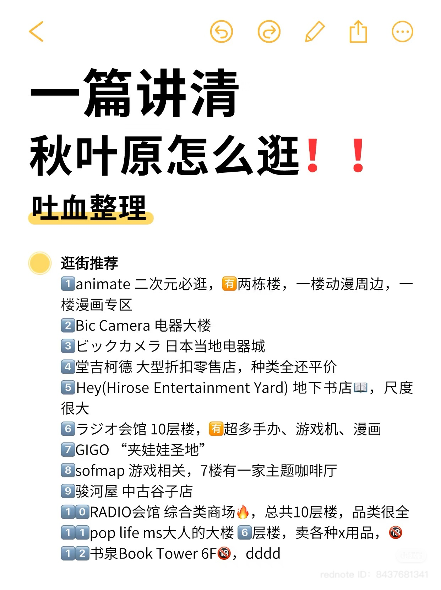
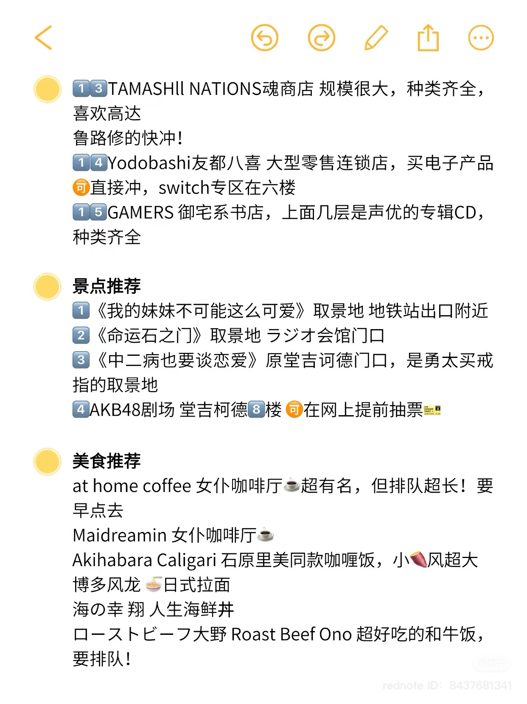
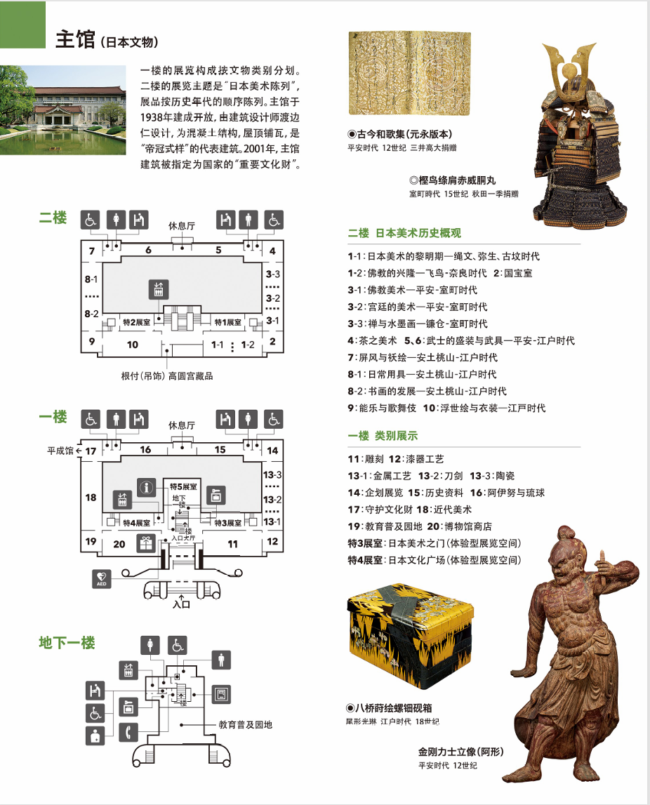
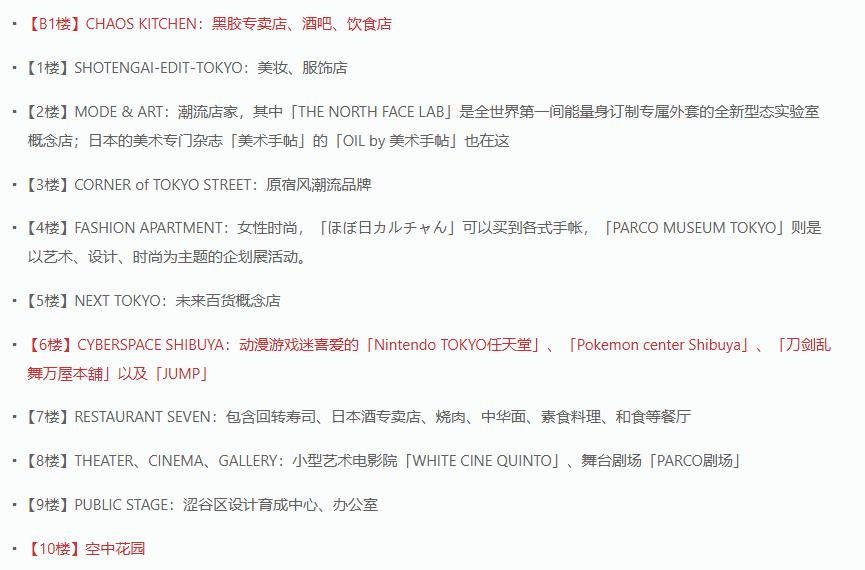

+++
title = 'Japan'
date = 2025-03-15T11:42:09+08:00
draft = false
+++

# 日本

## 必备物品

交通 JR Pass（七日券）  
Tablelog（日本大众点评）  
西瓜卡

## 东京

### 秋叶原

> 假面骑士专卖店

> 一番赏抽取

### 东京国立博物馆
闭馆日：星期一（如遇法定节假日则开馆，翌日工作日闭馆）  
开馆时间：9:30-17:00  
购票链接：[东京国立博物馆](https://www.asoview.com/channel/ticket/WuX1M0a3sG/ticket0000027926/)

>主馆正门左边可以制作浮世绘

### 浅草寺

### 东京塔

适合晚上去

### 涉谷PARCO

营业时间 百货商店 11:00～21:00、餐厅 11:30～23:00

6楼卡普空，宝可梦

## 京都

### 伏见稻荷大社

### 

## 大版

### 心斋桥

## 奈良

### 奈良公园

喂食野生鹿群

大版海游馆