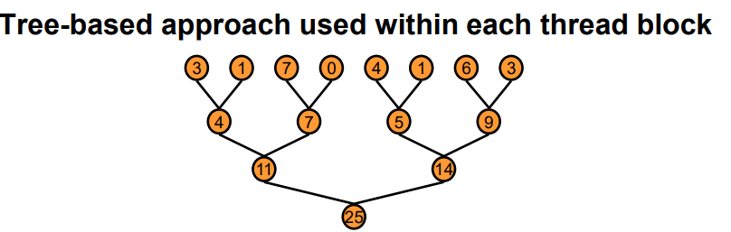

+++
title = 'Reduction'
date = 2023-04-17T11:23:09+08:00
draft = false
tags = ['GPU']
categories = ["GPU"]
+++
# Reduction

## 概念
可以将Reduce操作视为计算$x = x_0\oplus x_1\oplus x_2\oplus ...\oplus x_n$，$\oplus $作为算子可以表示为乘法，加法，最小值等运算



简易版Reduce
```cpp
//一个基础的Reduce操作,源自NVDIA的教程
__global__ void reduce0(int* g_idata, int* g_odata)
{
    extern __shared__ int sdata[];
    unsigned int tid = threadIdx.x;
    unsigned int i = blockIdx.x*blockDim.x + threadIdx.x;
    sdata[tid] = g_idata[i];
    __syncthreads();
    for(unsigned int s=1; s < blockDim.x; s *= 2)
    {   // 此处有warp divergent，并非所有thread都可以进入这个分支中，会造成硬件资源的浪费
        // 其次取模操作需要消耗大量计算时间
        if(tid % (2*s) == 0)        
        {
            sdata[tid] += sdata[tid + s];
        }
        __syncthreads();
    }
    if(tid == 0)
    {
        g_odata[blockIdx.x] = sdata[0];
    }

}
```
修改了if语句以尽量消除warp divergent。但是会产生bank conflict（即不同thread同时访问shared memory下的同一bank）
```cpp
__global__ void reduce2()
{
    extern __shared__ int sdata[];
    unsigned int tid = threadIdx.x;
    unsigned int i = blockIdx.x*blockDim.x + threadIdx.x;
    sdata[tid] = g_idata[i];
    __syncthreads();
    for(unsigned int s = 1; s < blockDim.x; s *= 2)
    {   
        int index = 2 * s * tid;
        if(index < blockDim.x)
        {
            // 会发生bank conflict
            // 例如在第一次循环中，对于tid为0的线程，会访问sdata的0和1位置
            // 对于第16个线程，会访问sdata的32和33的位置
            // 0和32位于bank0位置，1和33位于bank1的位置，会产生冲突
            // 因此需要改变对数组的读取方式
            sdata[index] += sdata[index+s];
        }
        __syncthreads();
    }
    if(tid == 0)
    {
        g_odata[blockIdx.x] = sdata[0];
    }
}
```

修改对数组的遍历方式以消除bank conflict
```cpp
__global__ void reduce3()
{
    extern __shared__ int sdata[];
    unsigned int tid = threadIdx.x;
    unsigned int i = blockIdx.x*blockDim.x + threadIdx.x;
    sdata[tid] = g_idata[i];
    __syncthreads();
    for(unsigned int s = blockDim.x/2; s > 0; s >>= 1)
    {   
        if(tid < s)
        {
            sdata[tid] += sdata[tid + s];
        }
        __syncthreads();
    }
    if(tid == 0)
    {
        g_odata[blockIdx.x] = sdata[0];
    }
}
```

后续优化 continue...


## 调用CUB库执行Reduce

CUB库是一个用于GPU的基本操作库，其中包含了一些基本的操作，如Reduce、Scan等。

CUB的Reduce操作可以分为BlockReduce，DeviceReduce和WarpReduce。
DeviceReduce的主体思路是调用两次Reduce操作，第一次在block上进行Reduce，将结果计入`d_out`,然后再进行一次Reduce获得值。
```cpp
#include <cub/cub.cuh>

size_t utils::cubTempStorageBytes = 0;
void *utils::cubTempStorage = nullptr;

static void *cubTempStorage;
static size_t cubTempStorageBytes;
void utils::allocCubTemp()
{
    printf("CUB use mem: %d bytes\n", cubTempStorageBytes);
    checkCudaErrors(cudaMalloc((void **)&cubTempStorage, cubTempStorageBytes * sizeof(int)));
}

template <typename T>
void utils::maxReduceRegist(int num_items)
{
    T *d_in = nullptr;
    T *d_out = nullptr;
    void *storage = nullptr;
    size_t storage_bytes = 0;
    cub::DeviceReduce::Max(storage, storage_bytes, d_in, d_out, num_items);
    if (storage_bytes > cubTempStorageBytes)
        cubTempStorageBytes = storage_bytes;
}

template <typename T>
void utils::maxReduce(T *d_in, T *d_out, int num_items)
{
    cub::DeviceReduce::Max(cubTempStorage, cubTempStorageBytes, d_in, d_out, num_items);
}

```

## CUB库的Reduce操作


```cpp
template <
    typename                    InputIteratorT,
    typename                    OutputIteratorT>
CUB_RUNTIME_FUNCTION
static cudaError_t Max(
    void                        *d_temp_storage,                    ///< [in] Device-accessible allocation of temporary storage.  When NULL, the required allocation size is written to \p temp_storage_bytes and no work is done.
    size_t                      &temp_storage_bytes,                ///< [in,out] Reference to size in bytes of \p d_temp_storage allocation
    InputIteratorT              d_in,                               ///< [in] Pointer to the input sequence of data items
    OutputIteratorT             d_out,                              ///< [out] Pointer to the output aggregate
    int                         num_items,                          ///< [in] Total number of input items (i.e., length of \p d_in)
    cudaStream_t                stream              = 0,            ///< [in] <b>[optional]</b> CUDA stream to launch kernels within.  Default is stream<sub>0</sub>.
    bool                        debug_synchronous   = false)        ///< [in] <b>[optional]</b> Whether or not to synchronize the stream after every kernel launch to check for errors.  Also causes launch configurations to be printed to the console.  Default is \p false.
{
    // Signed integer type for global offsets
    typedef int OffsetT;

    // The input value type
    typedef typename std::iterator_traits<InputIteratorT>::value_type InputT;

    // 此处为入口
    return DispatchReduce<InputIteratorT, OutputIteratorT, OffsetT, cub::Max>::Dispatch(
        d_temp_storage,
        temp_storage_bytes,
        d_in,
        d_out,
        num_items,
        cub::Max(),
        Traits<InputT>::Lowest(),    // replace with std::numeric_limits<T>::lowest() when C++11 support is more prevalent
        stream,
        debug_synchronous);
}
```
```cpp
    CUB_RUNTIME_FUNCTION __forceinline__
    static cudaError_t Dispatch(
        void            *d_temp_storage,                    ///< [in] Device-accessible allocation of temporary storage.  When NULL, the required allocation size is written to \p temp_storage_bytes and no work is done.
        size_t          &temp_storage_bytes,                ///< [in,out] Reference to size in bytes of \p d_temp_storage allocation
        InputIteratorT  d_in,                               ///< [in] Pointer to the input sequence of data items
        OutputIteratorT d_out,                              ///< [out] Pointer to the output aggregate
        OffsetT         num_items,                          ///< [in] Total number of input items (i.e., length of \p d_in)
        ReductionOpT    reduction_op,                       ///< [in] Binary reduction functor
        OutputT         init,                               ///< [in] The initial value of the reduction
        cudaStream_t    stream,                             ///< [in] <b>[optional]</b> CUDA stream to launch kernels within.  Default is stream<sub>0</sub>.
        bool            debug_synchronous)                  ///< [in] <b>[optional]</b> Whether or not to synchronize the stream after every kernel launch to check for errors.  Also causes launch configurations to be printed to the console.  Default is \p false.
    {
        typedef typename DispatchReduce::MaxPolicy MaxPolicyT;

        cudaError error = cudaSuccess;
        do
        {
            // Get PTX version
            int ptx_version = 0;
            if (CubDebug(error = PtxVersion(ptx_version))) break;

            // Create dispatch functor
            DispatchReduce dispatch(
                d_temp_storage, temp_storage_bytes,
                d_in, d_out, num_items, reduction_op, init,
                stream, debug_synchronous, ptx_version);

            // Dispatch to chained policy
            if (CubDebug(error = MaxPolicyT::Invoke(ptx_version, dispatch))) break;
        }
        while (0);

        return error;
    }

```
```cpp
    /// Invocation
    template <typename ActivePolicyT>
    CUB_RUNTIME_FUNCTION __forceinline__
    cudaError_t Invoke()
    {
        typedef typename ActivePolicyT::SingleTilePolicy    SingleTilePolicyT;
        typedef typename DispatchReduce::MaxPolicy          MaxPolicyT;

        // Force kernel code-generation in all compiler passes
        if (num_items <= (SingleTilePolicyT::BLOCK_THREADS * SingleTilePolicyT::ITEMS_PER_THREAD))
        {
            // Small, single tile size
            return InvokeSingleTile<ActivePolicyT>(
                DeviceReduceSingleTileKernel<MaxPolicyT, InputIteratorT, OutputIteratorT, OffsetT, ReductionOpT, OutputT>);
        }
        else
        {
            // Regular size
            return InvokePasses<ActivePolicyT>(
                DeviceReduceKernel<typename DispatchReduce::MaxPolicy, InputIteratorT, OutputT*, OffsetT, ReductionOpT>,
                DeviceReduceSingleTileKernel<MaxPolicyT, OutputT*, OutputIteratorT, OffsetT, ReductionOpT, OutputT>);
        }
    }
```


此处为CUB库中Reduce操作的核心函数，以`InvokePasses`为例
```cpp
    //------------------------------------------------------------------------------
    // Normal problem size invocation (two-pass)
    //------------------------------------------------------------------------------

    /// Invoke two-passes to reduce
    template <
        typename                ActivePolicyT,              ///< Umbrella policy active for the target device
        typename                ReduceKernelT,              ///< Function type of cub::DeviceReduceKernel
        typename                SingleTileKernelT>          ///< Function type of cub::DeviceReduceSingleTileKernel
    CUB_RUNTIME_FUNCTION __forceinline__
    cudaError_t InvokePasses(
        ReduceKernelT           reduce_kernel,          ///< [in] Kernel function pointer to parameterization of cub::DeviceReduceKernel
        SingleTileKernelT       single_tile_kernel)     ///< [in] Kernel function pointer to parameterization of cub::DeviceReduceSingleTileKernel
    {
#ifndef CUB_RUNTIME_ENABLED
        (void)                  reduce_kernel;
        (void)                  single_tile_kernel;

        // Kernel launch not supported from this device
        return CubDebug(cudaErrorNotSupported );
#else

        cudaError error = cudaSuccess;
        do
        {
            // Get device ordinal
            int device_ordinal;
            if (CubDebug(error = cudaGetDevice(&device_ordinal))) break;

            // Get SM count
            int sm_count;
            if (CubDebug(error = cudaDeviceGetAttribute (&sm_count, cudaDevAttrMultiProcessorCount, device_ordinal))) break;

            // Init regular kernel configuration
            KernelConfig reduce_config;
            if (CubDebug(error = reduce_config.Init<typename ActivePolicyT::ReducePolicy>(reduce_kernel))) break;
            int reduce_device_occupancy = reduce_config.sm_occupancy * sm_count;

            // Even-share work distribution
            int max_blocks = reduce_device_occupancy * CUB_SUBSCRIPTION_FACTOR(ptx_version);
            GridEvenShare<OffsetT> even_share;
            even_share.DispatchInit(num_items, max_blocks, reduce_config.tile_size);

            // Temporary storage allocation requirements
            void* allocations[1] = {};
            size_t allocation_sizes[1] =
            {
                max_blocks * sizeof(OutputT)    // bytes needed for privatized block reductions
            };

            // Alias the temporary allocations from the single storage blob (or compute the necessary size of the blob)
            if (CubDebug(error = AliasTemporaries(d_temp_storage, temp_storage_bytes, allocations, allocation_sizes))) break;
            if (d_temp_storage == NULL)
            {
                // Return if the caller is simply requesting the size of the storage allocation
                return cudaSuccess;
            }

            // Alias the allocation for the privatized per-block reductions
            OutputT *d_block_reductions = (OutputT*) allocations[0];

            // Get grid size for device_reduce_sweep_kernel
            int reduce_grid_size = even_share.grid_size;

            // Log device_reduce_sweep_kernel configuration
            if (debug_synchronous) _CubLog("Invoking DeviceReduceKernel<<<%d, %d, 0, %lld>>>(), %d items per thread, %d SM occupancy\n",
                reduce_grid_size,
                ActivePolicyT::ReducePolicy::BLOCK_THREADS,
                (long long) stream,
                ActivePolicyT::ReducePolicy::ITEMS_PER_THREAD,
                reduce_config.sm_occupancy);

            // Invoke DeviceReduceKernel
            THRUST_NS_QUALIFIER::cuda_cub::launcher::triple_chevron(
                reduce_grid_size, ActivePolicyT::ReducePolicy::BLOCK_THREADS,
                0, stream
            ).doit(reduce_kernel,
                d_in,
                d_block_reductions,
                num_items,
                even_share,
                reduction_op);

            // Check for failure to launch
            if (CubDebug(error = cudaPeekAtLastError())) break;

            // Sync the stream if specified to flush runtime errors
            if (debug_synchronous && (CubDebug(error = DebugSyncStream(stream)))) break;

            // Log single_reduce_sweep_kernel configuration
            if (debug_synchronous) _CubLog("Invoking DeviceReduceSingleTileKernel<<<1, %d, 0, %lld>>>(), %d items per thread\n",
                ActivePolicyT::SingleTilePolicy::BLOCK_THREADS,
                (long long) stream,
                ActivePolicyT::SingleTilePolicy::ITEMS_PER_THREAD);

            // Invoke DeviceReduceSingleTileKernel
            THRUST_NS_QUALIFIER::cuda_cub::launcher::triple_chevron(
                1, ActivePolicyT::SingleTilePolicy::BLOCK_THREADS, 0, stream
            ).doit(single_tile_kernel,
                d_block_reductions,
                d_out,
                reduce_grid_size,
                reduction_op,
                init);

            // Check for failure to launch
            if (CubDebug(error = cudaPeekAtLastError())) break;

            // Sync the stream if specified to flush runtime errors
            if (debug_synchronous && (CubDebug(error = DebugSyncStream(stream)))) break;
        }
        while (0);

        return error;

#endif // CUB_RUNTIME_ENABLED

    }
```