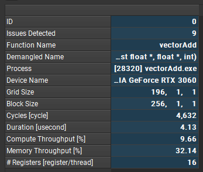
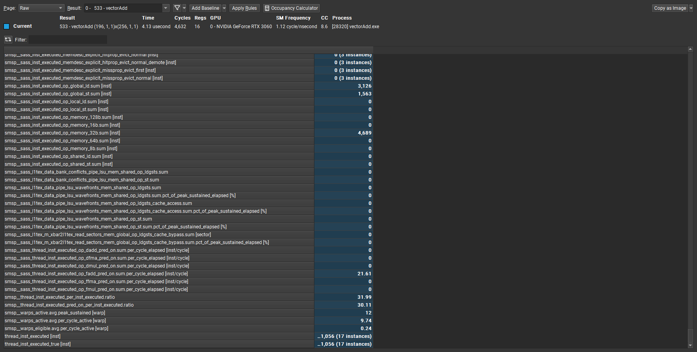

+++
title = 'Nsight Compute note'
date = 2024-02-26T18:26:30+08:00
draft = true
+++

# nsight compute

GPUs: Pascal, Volta, Turing, Ampere, and future architectures

报告所用exe由[cuda-samples-11.8](https://github.com/NVIDIA/cuda-samples/releases/tag/v11.8)的vectorAdd项目生成


## some basic concepts

> SMSP: 
>   sub-partition of SM。在 NVIDIA GPU 中，"sub-partition" 是指在每个 Streaming Multiprocessor   (SM) 中的物理资源分配单元。在某些 NVIDIA GPU 架构中，每个 SM 可以被进一步分成多个 sub-partition，每个 sub-partition 拥有自己的寄存器文件、共享内存以及其他资源。
> 这种细分使得每个 SM 内的资源能够更加灵活地分配给并行执行的线程块，从而提高了资源利用率和并行性。通过 sub-partition，开发人员可以更好地控制和优化在每个 SM 上执行的并行计算任务，以实现更高的性能和效率。
> sub-partition 的概念允许开发人员更精细地管理并行计算任务在 GPU 上的执行，从而最大程度地发挥硬件资源的潜力。

## Summary


Cycles：在GPU上执行的周期数

Compute Throughput：

Memory Throughput:

Registers：Number of registers allocated per thread

## Details

### GPU Speed Of Light Throughput

### Compute Workload Analysis

### Memory Workload Analysis
提高Memory的利用率和减少冗余的传输
### Scheduler Statistics

### Occupancy Analysis

### Warp State Statistics

long scoreboard stall: 由于寄存器依赖关系导致的warp停滞,通常是global memory latency
```cpp
__global__ void stall_reason_lsb(int* dramptr)
{
    int tid = threadIdx.x;
    int laneid = tid % 32;
    dramptr[laneid] = laneid;
    __syncthreads();

    int idx = laneid;
#pragma unroll
    for(int i = 0; i < 1000; i++)
        idx = dramptr[idx];
    dramptr[idx] = idx;
}
```

LG Throttle: too many & frequent global access
```cpp
__global__ void stall_reason_lg_worst(int8_t* dramptr, int8_t* dramptr2)
{
    int tid = threadIdx.x;
    int offset = tid * 1000;
#pragma unroll
    for(int i = 0; i < 2000; i++)
    {
        dramptr2[offset + i] = dramptr[offset + i];
    }
}
```

short scoreboard stall: 由于寄存器依赖关系导致的warp停滞,通常是shared memory latency

### Instruction Statistics

### NVLink Topology

### NVLink Tables

### Launch Statistics

### Occupancy

### Source Counters

## Call Stack/ NVT

## Source
使用-lineinfo获得代码和指令的映射关系

## raw

记录原始的性能数据，包括各种指标，内存访问，指令执行，数据传输等
