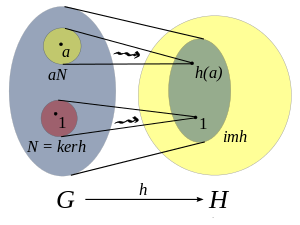
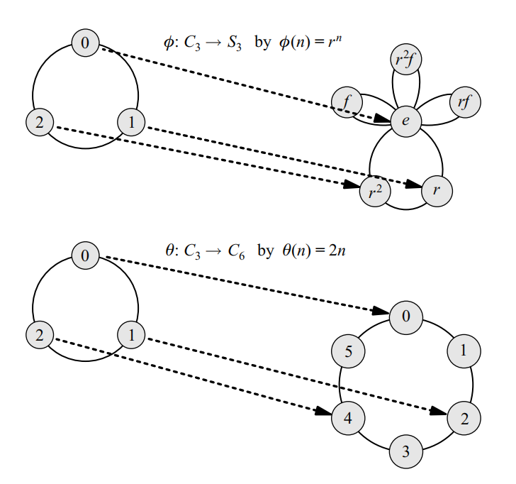
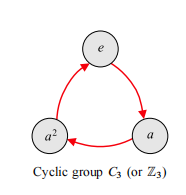
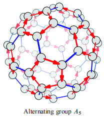
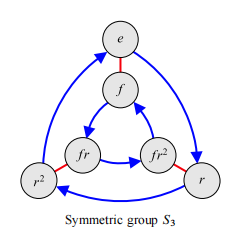

+++
title = 'Abstract Algebra'
date = 2024-02-26T19:08:59+08:00
draft = false
tags = ['math']
categories = ["math"]
+++

# 抽象代数

## 1.1 群

满足四个性质：
1. 封闭性：对于任意的$a,b\in G$，都有$a\circ b\in G$。
2. 结合律：对于任意的$a,b,c\in G$，都有$(a\circ b)\circ c=a\circ(b\circ c)$。
3. 幺元：存在一个元素$e\in G$，使得对于任意的$a\in G$，都有$e\circ a=a\circ e=a$。
4. 逆元：对于任意的$a\in G$，都存在一个元素$b\in G$，使得$a\circ b=b\circ a=e$。

可以看到群并没有要求交换律。如果群内任意元素均满足$a\circ b=b\circ a$，则称该群为阿贝尔群。

半群：
    满足封闭性和结合律，但不满足幺元和逆元。
## 1.2 群的同构和同态

同构：
若群$G$和$H$之间存在一个双射$\varphi:G\to H$,使得$f(a)=A$和$f(b)=B$，则有$f(a\circ b)=f(a)\ast f(b)$。

> 例：群$G(\mathbb{Z}/4\mathbb{Z},+)$和群$H(\left\\{1,i,-1,-i\right\\},\times)$同构。

同态：
给定两个群$(G,\circ)$和$(H,\ast)$，如果存在一个映射$\varphi:G\to H$，使得对于任意的$a,b\in G$，都有$\varphi(a\circ b)=\varphi(a)\ast\varphi(b)$，那么称$\varphi$是一个群的同态。因此可以说，同构是满足双射的同态

> 例1：$f(x)=x^2$是一个从实数到非负实数的同态。\
> 例2：C3循环群和S3交换群同态，C3循环群和C6循环群同态

## 1.3 常见群

常见矩阵群：
一般线性群$GL(n)$:其单位元为单位矩阵，逆元为一个矩阵的逆矩阵。

特殊正交群$SO(n)$:

特殊欧式群$SE(n)$:

特殊射影群$SP(n)$

循环群：

  

交换群

  

对称群：n个对象所有的重新排列组成对称群$S_n$，可参考(https://zhuanlan.zhihu.com/p/402197369)

  

## 环

2.1 环的定义
如果一个非空集合$R$上定义了两个二元运算$+$和$\times$，分别称为加法和乘法，满足：
（1）$(R,+)$是阿贝尔群
（2）$(R,\times)$是半群
（3）乘法对于加法满足左分配律、右分配律，则称$R$
 关于运算$\times$，$+$构成一个环（ring），记为$(R,+,\times)$

## 域

