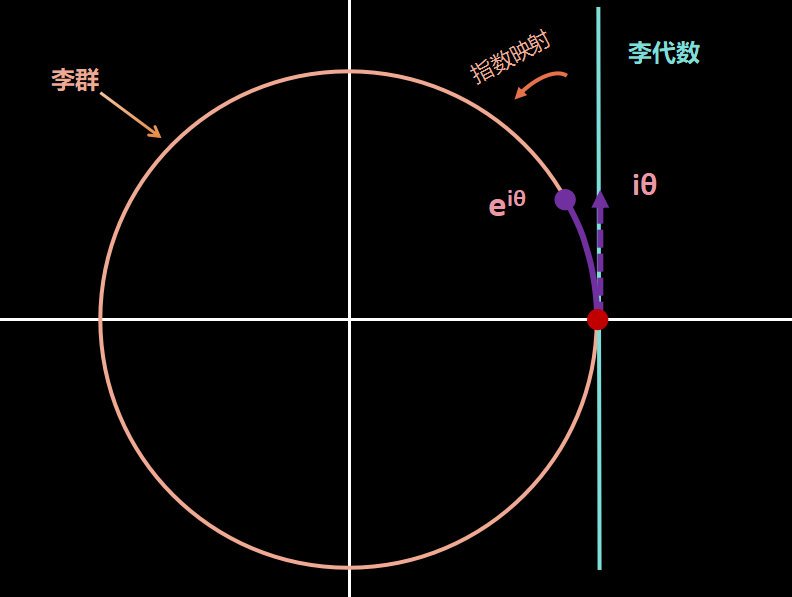
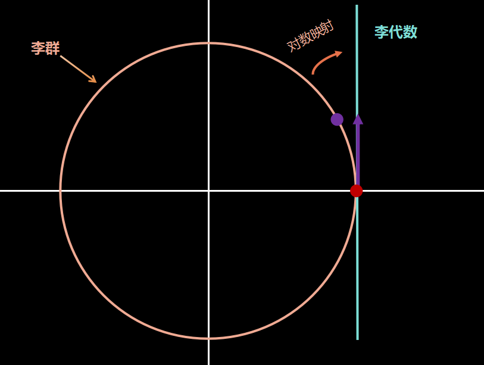

+++
title = 'Lie Group'
date = 2024-02-26T19:08:59+08:00
draft = false
tags = ['math']
categories = ["math"]
+++

# 李群

李群指具有群结构的光滑微分流形，在物理上描述的是连续的对称性

>例：\
    对于模为1的复数集合，其可以表示为$e^{i\theta}$，显然该集合对于乘法封闭，满足群的四个基本要求，所以说其具有群结构。\
>相对应的这个集合可以在复平面上绘制成一个圆，此时，圆上的任意一点，都可以用赋予其的值$\theta$表示其坐标，其等价于一个一维流形，且其上的乘法运算是光滑的，因此这个集合是一个李群

李代数：李群上的切空间。描述了李群的局部性质李代数由一个集合$V$，一个数域$F$ 和一个二元运算 $[,]$ 组成。如果它们满足以下几条性质，称 (V; F; [, ]) 为一个李代数，记作 g。

>封闭性: $\forall \mathbf{X}, \mathbf{Y} \in V,[\mathbf{X}, \mathbf{Y}] \in V$\
>双线性: $\forall \mathbf{X}, \mathbf{Y}, \mathbf{Z} \in V, a, b \in F$ ，有$[a \mathbf{X}+b \mathbf{Y}, \mathbf{Z}]=a[\mathbf{X}, \mathbf{Z}]+[\mathbf{Y}, \mathbf{Z}],[\mathbf{Z}, a \mathbf{X}+b \mathbf{Y}]=a[\mathbf{Z}, \mathbf{X}]+b[\mathbf{Z}, \mathbf{Y}]$\
>自反性: $\forall \mathbf{X} \in V,[\mathbf{X}, \mathbf{X}]=\mathbf{0}$\
>雅可比等价: $\forall \mathbf{X}, \mathbf{Y}, \mathbf{Z} \in V,[\mathbf{X},[\mathbf{Y}, \mathbf{Z}]]+[\mathbf{Z},[\mathbf{X}, \mathbf{Y}]]+[\mathbf{Y},[\mathbf{Z}, \mathbf{X}]]=\mathbf{0}$

其中的二元运算称为李括号，他表示了两个元素之间的差异，在$R^3$空间中上定义的叉积就是一种李括号，此时$g=(R^3,R,\times)$构成了李代数

指数映射：将切空间上的切向量映射到流形上点的动作

对数映射：将流形上的点映射到切空间的切向量上

## O(2)

## SO(2)

## SU(2)

对于单位四元数$a+bi+cj+dk$
其左乘矩阵形式等价于$\left[\begin{array}{ccc}a & -b & -c & -d \\\ 
b & a & -d & c \\\ 
c & d & a & -b \\\ 
d & -c & -b & -a\end{array}\right]$，右乘矩阵等价为$\left[\begin{array}{ccc}a & -b & -c & -d \\\ 
b & a & d & -c \\\ 
c & -d & a & b \\\ 
d & c & -b & a\end{array}\right]$，以右乘矩阵为例，其每个子矩阵代表了一个复数，如果将其改写为复数矩阵，形式为$\left[\begin{array}{ccc}a+bi & -c+di\\\
c + di & a-bi\end{array}\right]$此时，该矩阵为酉矩阵。且对于单位四元数，该矩阵的特征值为1。

$\operatorname{SU}(2)$群是一个矩阵群，群元素为$2\times2$的幺正矩阵，且行列式为1

## SO(3)

对于旋转，它只有三个自由度，但是使用旋转矩阵就会有9个量，显然使用旋转矩阵表达旋转是冗余的，理论上可以用3个量来表示旋转.

$\operatorname{SO}(3)$ 群是一个常见的李群，若将$\operatorname{SO}(3)$群视为全体三维空间中，顺时针转动任意角度的集合，有：

$$\operatorname{SO}(3) \equiv \left\\{\begin{array}{l|l}
\mathcal{R}(\vec{\omega}) & \begin{array}{l}
\vec{\omega}=\omega \vec{n}, \vec{n}=(\cos \varphi \sin \theta, \sin \varphi \sin \theta, \cos \theta) \\\
\omega \in[0, \pi], \theta \in[0, \pi], \varphi \in[0,2 \pi]
\end{array}
\end{array}\right\\}$$

在式$\vec{\omega}=\omega \vec{n}$中，$\vec{n}$是旋转轴，模长为1，$\omega$是绕$\vec{n}$旋转的角度。
$\mathcal{R}(\vec{\omega})$表示绕$\vec{\omega}$轴旋转$\omega$角度的操作。
因此，我们可以将$\operatorname{SO}(3)$群视作由$\vec{\omega}$端点构成的半径为$\pi$的实心球

<!-- 任何$\operatorname{SO}(3)$的元素都可以表示为三个初等旋转矩阵的乘积 -->

## 从SO(3)群推导罗德里格斯公式

对于三维旋转群$\operatorname{SO}(3)$，其集合内元素满足

$$\det R=1$$
$$R^TR=I$$
若考虑其为时间$t$的函数，则有$\mathbf{R}(t)^T\mathbf{R}(t)=\mathbf{I}$。对其求导，有
$$\dot{\mathbf{R}}(t) \mathbf{R}(t)^T+\mathbf{R}(t) \dot{\mathbf{R}}(t)^T=0$$
$$\dot{\mathbf{R}}(t) \mathbf{R}(t)^T=-\mathbf{R}(t) \dot{\mathbf{R}}(t)^T$$
不难发现，$\mathbf{R}(t) \dot{\mathbf{R}}(t)^T$是一个反对称矩阵。因此，我们可以将其记作${\mathbf{A}}$，对于这个$3\times 3$反对称矩阵，其对角线元素为0，因此其只有三个自由度，可以将其对应于三维向量$\mathbf{a} = [a_1, a_2, a_3]^T$，因此对于矩阵A我们可以将其表示为：
$$\mathbf{a}^{\wedge} = \mathbf{A}=\begin{bmatrix}
 0 & -a_3 & a_2 \\\
  a_3 & 0 & -a_1 \\\
 -a_2 & a_1 & 0
\end{bmatrix}$$
其中$\mathbf{a}^{\wedge}$表示$\mathbf{a}$所对应的反对称矩阵。因此我们使用$\phi(t)^{\wedge}$对应$\dot{\mathbf{R}}(t) \mathbf{R}(t)^T$,即：
$$\dot{\mathbf{R}}(t) \mathbf{R}(t)^T=\phi(t)^{\wedge}$$
此时，$$\dot{\mathbf{R}}(t)=\phi(t)^{\wedge} \mathbf{R}(t)=\left[\begin{array}{ccc}0 & -\phi_3 & \phi_2 \\\ \phi_3 & 0 & -\phi_1 \\\ -\phi_2 & \phi_1 & 0\end{array}\right] \mathbf{R}(t)$$
不难发现其对应于关于$\mathbf{R}$的微分方程：
$$\mathbf{R}(t)=\exp \left(\phi(t)^{\wedge}\right) \mathbf{R}\left(t_0\right)$$

任意矩阵的指数映射可以使用泰勒展开进行近似，对于$\exp \left(\phi(t)^{\wedge}\right)$，我们可以使用泰勒展开进行近似：
$$\exp \left(\phi(t)^{\wedge}\right)=\mathbf{I}+\phi(t)^{\wedge}+\frac{\left(\phi(t)^{\wedge}\right)^2}{2 !}+\frac{\left(\phi(t)^{\wedge}\right)^3}{3 !}+\cdots$$

对于三维向量$\phi$，可以使用,假设其模长为$\theta$,方向为$a$，即$\phi=\theta {a}$，因此$\phi^{\wedge}=\theta {a}^{\wedge}$。
且有两个性质：
$$
\begin{aligned}
& a^{\wedge} a^{\wedge}=a a^T-I \\\
& a^{\wedge} a^{\wedge} a^{\wedge}=-a^{\wedge}
\end{aligned}
$$
因此上式可展开为：
$$
\begin{aligned}
& \mathbf{R}=\exp \left(\phi^{\wedge}\right)=\exp \left(\theta a^{\wedge}\right)=\sum_{n=0}^{\infty} \frac{1}{n !}\left(\theta a^{\wedge}\right)^n \\\
& =I+\theta a^{\wedge}+\frac{1}{2 !} \theta^2 a^{\wedge} a^{\wedge}+\frac{1}{3 !} \theta^3 a^{\wedge} a^{\wedge} a^{\wedge}+\frac{1}{4 !} \theta^4\left(a^{\wedge}\right)^4+\ldots \\\
& =a a^T-a^{\wedge} a^{\wedge}+\theta a^{\wedge}+\frac{1}{2 !} \theta^2 a^{\wedge} a^{\wedge}-\frac{1}{3 !} \theta^3 a^{\wedge}-\frac{1}{4 !} \theta^3\left(a^{\wedge}\right)^2+\ldots \\\
& =a a^T+\left(\theta-\frac{1}{3 !} \theta^3+\frac{1}{5 !} \theta^5-\ldots\right) a^{\wedge}-\left(1-\frac{1}{2 !} \theta^2+\frac{1}{4 !} \theta^4-\ldots\right) a^{\wedge} a^{\wedge} \\\
& =a^{\wedge} a^{\wedge}+I \sin \theta a^{\wedge}-\cos \theta a^{\wedge} a^{\wedge} \\\
& =(1-\cos \theta) a^{\wedge} a^{\wedge}+I+\sin \theta a^{\wedge} \\\
& =\cos \theta I+(1-\cos \theta) a a^T+\sin \theta a^{\wedge}
\end{aligned}
$$

$\operatorname{SO}(3)$李代数：物理意义为旋转向量
$$
\mathfrak{so}(3)=\left\\{\phi \in \mathbb{R}^3, \boldsymbol{\Phi}=\boldsymbol{\phi}^{\wedge} \in \mathbb{R}^{3 \times 3}\right\\} .
$$

>四元数插值
    Nlerp
    Slerp

$\operatorname{SU}(2)$

## SE(3)

$\operatorname{SE(3)}$群是一个六维李群，它是三维旋转群$\operatorname{SO(3)}$和三维平移群$\mathbb{R}^3$的直积，即：

$$\begin{equation}
\operatorname{SE(3)}= \left\\{\left[\begin{array}{ccc}\mathbf{R} & \mathbf{P} \\\ \mathbf{0} & 1\end{array}\right]\mathbf{P} \in \mathbb{R}^3, \mathbf{R} \in \operatorname{SO(3)}    \right\\}
\end{equation}$$

作为矩阵李群，$\operatorname{SE(3)}$代表一种齐次坐标变换，可以代表某种刚体运动的集合

>对偶四元数插值：
$$
\operatorname{DQLERP}\left(Q_0, Q_1, t\right):=\frac{Q_0+t\left(Q_1-Q_0\right)}{\left\||Q_0+t\left(Q_1-Q_0\right)|\right\|}
$$
>$\operatorname{ScLERP}$插值，SE(3)中Q0到Q1的测地线

## 李群的旋转插值
