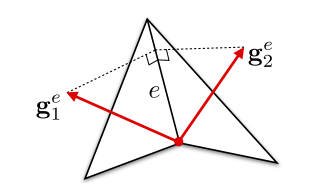

+++
title = 'Heat Method for Geodesic'
date = 2023-10-08T19:08:59+08:00
draft = false
+++

# 基于热的测地线距离以及向量平行传输

## heat method
$\phi(x,y) = \lim _{t \rightarrow 0} \sqrt{-4t \log {k_t}(x,y)} $


当热核函数存在误差的时候，直接使用Varadhan公式会有非常显著的误差。

### Alg
在曲面上给定一点x上施加一个热源，并对其进行扩散获得温度场

1.$\frac{d}{dt}u = \Delta u$
取u为顶点坐标的函数，代入热传导方程并离散化后有$\frac{u^{k+1} - u^k}{h} = Lu^k$,隐式迭代下为$(I-tL)u^{k+1} = u^k$。此时，$u_0$代表
可以使用Cholesky分解或者Krylov子空间分解，在论文中，t的选取一般取平均边长的平方

2.$X = -\frac{\nabla u}{|\nabla u|}$
对温度场的梯度进行归一化后得到距离场扩散的向量场X

3.求解$\Delta u = \nabla \cdot X$
对于已知向量场X，如果希望寻找一个势场u使得u可以表示X，则可以构造迪利克雷能量
$E(u)=\int_{M}|\nabla u-X|^{2} d A$。
而最小化迪利克雷能量等价于求解泊松方程$\Delta u = \nabla \cdot X$

```cpp
/* Constructor
 * Input: The surface mesh <inputMesh> and geometry <inputGeo>.
 */
HeatMethod::HeatMethod(ManifoldSurfaceMesh* surfaceMesh, VertexPositionGeometry* geo) {

    this->mesh = surfaceMesh;
    this->geometry = geo;

    // TODO: Build Laplace and flow matrices.
    double h = this->geometry->meanEdgeLength();
    int N = mesh->nVertices();
    SparseMatrix<double> M = geometry->massMatrix();
    // Note: core/geometry.cpp has meanEdgeLength() function
    this->A = geometry->laplaceMatrix();
    this->F = M + h * h * A;
}

/*
 * Computes the vector field X = -∇u / |∇u|.
 *
 * Input: <u>, a dense vector representing the heat that is allowed to diffuse on the input mesh for a brief period of
 * time.
 * Returns: A MeshData container that stores a Vector3 per face.
 */
FaceData<Vector3> HeatMethod::computeVectorField(const Vector<double>& u) const {
    FaceData<Vector3> vf(*mesh, {0, 0, 0});

    for (Face f : mesh->faces()) {
        Vector3 grad{0, 0, 0};
        Vector3 normal = geometry->faceNormal(f);

        for (Halfedge he : f.adjacentHalfedges()) {
            Vector3 ePerp = geometry->inputVertexPositions[he.next().tipVertex()] -
                            geometry->inputVertexPositions[he.next().tailVertex()];
            ePerp = ePerp.rotateAround(normal, M_PI / 2);
            grad += ePerp * u[he.vertex().getIndex()];
        }
        vf[f.getIndex()] = -grad.normalizeCutoff();
    }

    return vf;
}

/*
 * Computes the integrated divergence ∇.X.
 *
 * Input: <X>, the vector field -∇u / |∇u| represented as a FaceData container
 * Returns: A dense vector
 */
Vector<double> HeatMethod::computeDivergence(const FaceData<Vector3>& X) const {
    Vector<double> div = Vector<double>::Zero(mesh->nVertices());

    for (Face f : mesh->faces()) {
        Vector3 Xj = X[f.getIndex()];
        for (Halfedge he : f.adjacentHalfedges()) {
            Vector3 e =
                geometry->inputVertexPositions[he.tipVertex()] - geometry->inputVertexPositions[he.tailVertex()];
            double val = 0.5 * geometry->cotan(he) * dot(e, Xj);
            div[he.tailVertex().getIndex()] += val;
            div[he.tipVertex().getIndex()] += -val;
        }
    }
    return div; // placeholder
}

/*
 * Computes the geodesic distances φ using the heat method.
 *
 * Input: <delta>, a dense vector representing the heat sources, i.e., u0 = δ(x). Returns: A dense vector containing the
 * geodesic distances per vertex.
 */
Vector<double> HeatMethod::compute(const Vector<double>& delta) const {
    Eigen::SimplicialLLT<SparseMatrix<double>> llt(F);
    Vector<double> u = llt.solve(delta);
    FaceData<Vector3> X = computeVectorField(u);
    Vector<double> deltaPhi = computeDivergence(X);

    SparseMatrix<double> A = this->A;
    geometrycentral::PositiveDefiniteSolver<double> solver(A);
    Vector<double> phi = solver.solve(-deltaPhi);

    // Since φ is unique up to an additive constant, it should be shifted such that the smallest distance is zero
    this->subtractMinimumDistance(phi);

    return phi;
}
```


### cotLaplacain推导
(https://zhuanlan.zhihu.com/p/372670140)

### 处理点云模型或者多边形模型

### 距离光顺

### 边界条件处理
1.迪利克雷条件

若泊松方程只存在迪利克雷边界，则只需将网格边界和内部分开来考虑即可
$$\left[\begin{array}{ll}
L_{I I} & L_{I B} \\\
L_{B I} & L_{B B}
\end{array}\right]\left[\begin{array}{l}
u_I \\\
u_B
\end{array}\right]=\left[\begin{array}{cc}
M_I & 0 \\\
0 & M_B
\end{array}\right]\left[\begin{array}{l}
f_I \\\
f_B
\end{array}\right]$$

2.纽曼条件

对于nuemann边界条件，$(\Delta u)_i=\frac{1}{2}\left(g_a+g_b\right)+\frac{1}{2} \sum_j\left(\cot \alpha_j+\cot \beta_j\right)\left(u_j-u_i\right)$

其中$g_a$和$g_b$分别代表给定方向导数在边界上的积分。

泊松方程可以表示为
$$\left[\begin{array}{ll}
L_{I I} & L_{I B} \\\
L_{B I} & L_{B B}
\end{array}\right]\left[\begin{array}{l}
u_I \\\
u_B
\end{array}\right]=\left[\begin{array}{l}
M_If_I \\\
M_Bf_B-g
\end{array}\right]$$
此时按照无边界条件处理

对于HeatMethod，使用平均边界条件$u = (u_N + u_D)$

### 收敛性

### 基于机器学习
对于一个嵌在$R^m$中的$d$维黎曼流形

1.将$V^0$沿着整个流形通过heat flow的方式进行传播获得流形上的向量场$V_s$

$$\min_{V} E(V) :=\int_{\mathcal{M}}\left\|V-V^{0}\right\|^{2} d x+t \int_{\mathcal{M}}\|\nabla V\|_{\mathrm{HS}}^{2} d x$$

2.向量场$V$归一化

3.最小化$\Phi(f)$
$$min_{f}\Phi(f):=\int_{\mathcal{M}}\|\nabla f-\hat{V}\|^{2} d x$$
$${ s.t. } f(p)=0$$

### heat method的并行

从热扩散方程中获得一个接近于单位向量场的可积分的梯度场，对该梯度场进行积分获得测地线距离

1.使用Gauss-Seidel迭代求解热扩散

$$u^{i}(v_j) = \frac{u_{0}(v_{j})+t \sum_{k\in \mathcal{N}_{j}} \theta _{j,k} u^{i-1}(v _{k})}{A _{v_j} + t \sum _{k\in \mathcal{N}(j)} \theta _{j, k}}
$$

2.获得可积分向量场
在原Heat Method中通过最小化迪利克雷能量来获得一个标量场使其梯度近似于单位向量场$h_i$，而在并行时使用ADMM求解器求解一个凸优化问题从而获得一个可积分的向量场$g_i$

凸优化问题

$$
\min_{\mathbf{g}_{i}} \sum _{f_i \in \mathcal{F}} A_i\left\|\mathbf{g}_i-\mathbf{h}_i\right\|^{2} \\\ \text{s.t.} \overline{\mathbf{e}} \cdot\left(\mathbf{g}_1^{e}-\mathbf{g}_2^{e}\right)=0 \quad \forall e \in \mathcal{E} _{\text {int }}
$$

下式代表对于共边的两个面，他们面上的梯度向量和共同边的点积必定相等

<center>



</center>

3.对向量场$g_i$进行积分
$$d(v_j)=d(v_k) + \frac{1}{\left|\mathcal{T}_ {j k}\right|} \sum_{f_l \in \mathcal{T}_ {j k}} \mathbf{g}_ {l} \cdot\left(\mathbf{p}_ j-\mathbf{p}_ k\right)$$

多源最短路径

优点：
    Gauss-Seidel和ADMM都可以快速收敛
    具有较低的内存占用，允许处理大网格
    可并行性强


### 可优化的部分

1. 用GMRES求解线性方程组
2. 时间t的选取
3. 加权距离计算

## Vector Heat Method

### Scalar Interpolation
使用高斯核插值
$$
G_t(x, y):=\frac{1}{(4 \pi t)^{n / 2}} e^{-d(x, y)^2 / 4 t}
$$

$$
\bar{u}_ t=\frac{u_1 G_{t, p_1}+u_2 G_{t, p_2}}{G_{t, p_1}+G_{t, p_2}}
$$
当t趋于0时，$\bar{u}_t$趋于$\frac{u_1+u_2}{2}$

### Connection Laplacian

### Vector Heat Method的并行分析

### 拓展

流形M的选择，向量空间的选择，流形上平行的定义  
例如：对于向量空间$V\in R$，向量的平行传输就变为了scalar interpolation
1. differential 1-forms，计算切丛
2. symmetric direction fields（对称方向场）向量场在每个点上的向量与通过该点的某条对称轴上的向量具有相同的方向
3. different connection

### application

1. 自由边界问题中推断scalar velocity和vector velocity（向量外推）
2. logmap\
    径向向量场$R$\
    平行向量场$H$
3. Karcher Means and Geometric Medianss