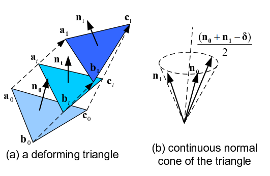
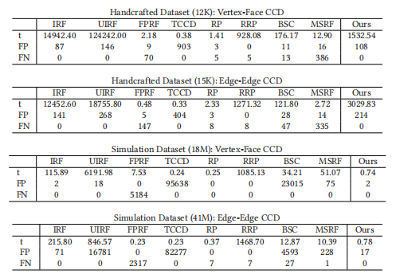

+++
title = 'mesh ccd'
date = 2023-05-01T19:08:59+08:00
draft = false
tags = ['simulation']
categories = ["simulation"]
+++

# mesh ccd

## 基本概念

### false positives

a collision is reported when there is no collision

### false negatives

a collision is not reported when there is a collision

### Multivariate CCD Formulation

$$\begin{align*}
&F_{\mathrm{vf}}(t, u, v)=p(t)-\left((1-u-v) v_1(t)+u v_2(t)+v v_3(t)\right)\\\
&F_{\mathrm{vf}}: \Omega_{\mathrm{vf}}=[0,1] \times\\\{u, v \geqslant 0 \mid u+v \leqslant 1\\\} \rightarrow \mathbb{R}^3\\\
&F_{\mathrm{ee}}(t, u, v)=\left((1-u) p_1(t)+u p_2(t)\right)-\left((1-v) p_3(t)+v p_4(t)\right)\\\
&F_{\mathrm{ee}}: \Omega_{\mathrm{ee}}=[0,1] \times[0,1]^2 \rightarrow \mathbb{R}^3
\end{align*}$$

### Univariate CCD Formulation

### Normal Cone test
给定连续曲面S以及其边界C，若其不自交，则必须通过surface normal test和contour test

1.存在一个向量$\vec{v}$，使(N.v)> 0对曲面上的任意点都成立\
2.轮廓C沿向量v的投影在投影平面上没有任何自交。

```cpp
struct cone
{
    Eigen::Vector3f axis;
    float angle;

    // input two axis and get the one axis
    void set(Eigen::Vector3f axis1, Eigen::Vector3f axis2)
    {
        axis = normalized(axis1 + axis2);
        angle = acos(axis1.dot(axis2)) * 0.5;
    }
};
```

### Continus Normal Cone
<center>


</center>
<!-- 给定一个可形变三角形，该三角形的在每一时刻的顶点位置可以通过线性插值得到，三角形的顶点分别为${a_0},{b_0},{c_0}$，下一时刻的顶点分别为${a_1},{b_1},{c_1}$，$\vec{V_a} = a_1 - a_0$, $\vec{V_b} = b_1 - b_0$, $\vec{V_c} = c_1 - c_0$  
假设t时刻三角形的法向量为$\vec{n_t}$
则 -->
$$\mathbf{n}_{\mathbf{t}}=\mathbf{n}_{\mathbf{0}} \cdot B_{0}^{2}(t)+\left(\mathbf{n}_{\mathbf{0}}+\mathbf{n}_{\mathbf{1}}-\delta\right) / 2 \cdot B_{1}^{2}(t)+\mathbf{n}_{\mathbf{1}} \cdot B_{2}^{2}(t)$$

基于伯恩斯坦基控制点的凸包性质，$\vec{n}_t$受到控制点的限制，控制点为$\mathbf{n_0}, \mathbf{n_1}, \mathbf{(n_0 + n_1 - \delta)/2}$

### 滤波器
代数非穿透滤波器(DNF)\
可以剔除不满足共面条件的碰撞对
>对于点面碰撞对，首先计算出三角形 ABC 的法线向量 n，然后计算四个点
>PABC 在 n 上的投影点之间的距离，若距离为零，则 PABC 共面，否则不共面。

空间线性投影滤波器

可以剔除部分不满足内部条件的碰撞对
>将空间中的碰撞对投影到空间中的某条直线上，根据投影点的位置关系来剔除不可能发生碰撞的碰撞对。 在点面碰撞中，若点的投影点始终在三角形3个顶点的投影点的同一侧，则可剔除；在边边碰撞中，若一条边的两个顶点的投影点始终在另一条边的两个顶点的投影点的同一侧，则可剔除。

基于深度神经网络优化的CCD算法剔除

## CCD Root finding
三次多项式或多变量求根问题，如果floating-point rounding error无限小，理论上可以精确求解CCD问题
> 1.基于Inclusion的二分法求根
 ```cpp
// 基础的区间算法
// 代码源自CCD-Wrapper
namespace Eigen
{
typedef Matrix<intervalccd::Interval, Dynamic, 1, ColMajor, 3, 1> VectorX3I;    //定义一个行数可变，但是不大于3，列数固定为1的列向量
}


bool interval_root_finder(const std::function<Eigen::VectorX3I(const Eigen::VectorX3I&)>& f,
                        const std::function<bool(const Eigen::VectorX3I&)>& constraint_predicate,
                        const Eigen::VectorX3I& x0,
                        const Eigen::VectorX3d& tol,
                        Eigen::VectorX3I& x,const bool check_vf)
{
    std::stack<std::pair<Eigen::VectorX3I, int>> xs;
    xs.emplace_back(x0, -1);
    while(!xs.empty())
    {
        // copresond to line 6
        x = xs.top().first;
        int last_split = xs.top().second;
        xs.pop();

        // copresond to line 7
        // compute the inclusion function
        Eigen::VectorX3I y = f(x);

        if (!zero_in(y)) {
            continue;
        }

        Eigen::VectorX3d widths = width(x);
        if ((widths.array() <= tol.array()).all()) {
            if (constraint_predicate(x)) {
                return true;
            }
            continue;
        }

        // Bisect the next dimension that is greater than its tolerance
        int split_i;
        for (int i = 1; i <= x.size(); i++) {
            split_i = (last_split + i) % x.size();
            if (widths(split_i) > tol(split_i)) {
                break;
            }
        }

        std::pair<Interval, Interval> halves = bisect(x(split_i));
        Eigen::VectorX3I x1 = x;
        // Push the second half on first so it is examined after the first half
        if(check_vf){
            if(split_i==1){
                if(interval_satisfy_constrain(halves.second,x(2))){
                    x(split_i) = halves.second;
                    xs.emplace(x, split_i);
                }
                if(interval_satisfy_constrain(halves.first,x(2))){
                    x(split_i) = halves.first;
                    xs.emplace(x, split_i);
                }
            }
            if(split_i==2){
                if(interval_satisfy_constrain(halves.second,x(1))){
                    x(split_i) = halves.second;
                    xs.emplace(x, split_i);
                }
                if(interval_satisfy_constrain(halves.first,x(1))){
                    x(split_i) = halves.first;
                    xs.emplace(x, split_i);
                }
            }
            if(split_i==0){
                x(split_i) = halves.second;
                xs.emplace(x, split_i);
                x(split_i) = halves.first;
                xs.emplace(x, split_i);
            }
        }
        else{
            x(split_i) = halves.second;
            xs.emplace(x, split_i);
            x(split_i) = halves.first;
            xs.emplace(x, split_i);
        }
        
        
    }
    }
    return false
}
```
> 2.浮点数高精度运算\
> 3.将数值问题转换为射线求交问题


大多数基于单变量公式的算法都会产生false negative

| 求解器                                                   | 优点                                                                             | 缺点                                                                                                                                                                                                                                     |
| -------------------------------------------------------- | -------------------------------------------------------------------------------- | ---------------------------------------------------------------------------------------------------------------------------------------------------------------------------------------------------------------------------------------- |
| interval root-finder (IRF)                               | 没有false negative，有少量的false positive，可以通过调整容差，通过准确性换取效率 | 区间算法为计算提增加了性能开销，例如计算两个区间的乘积$[a,b] [c,d] = [min(ac,ad,bc,bd),max(ac,ad,bc,bd)]$,需要四次乘法和两次min max操作                                                                                                  |
| univariate interval root-finder (UIRF) 刚体ccd的特殊情况 |                                                                                  | 如果多项式有无穷根，那么该算法将必须将整个域细化到最大允许分辨率，并检查每个区间的有效性，使其正确，但在退化情况下非常慢。这导致比多变量对应的平均运行时间更长。此外，也不可能控制其他两个参数（即u、v）的准确性，从而引入更多的假阳性。 |
| floating-point time-of-impact root finder (FPRF)         | 这种方法是速度最快的方法之一，是许多仿真代码中的主选。                           |
| TightCCD (TCCD)                                          | 保守的基于浮点数的实现，速度快，唯一没有false negative的非区间方法               | 产生了许多不可控制的false positive，这些false positive可能会导致不必要的碰撞检测，从而降低了整体性能。                                                                                                                                   |
| Root Parity (RP)                                         |                                                                                  | 根据根的奇偶性来判断是否有碰撞，但是无法区分0根和重根                                                                                                                                                                                    |
| rational implementation of Root Parity (RRP)             |                                                                                  | 根据根的奇偶性来判断是否有碰撞，但是无法区分0根和重根                                                                                                                                                                                    |
| BSC                                                      |                                                                                  |
| MSRF                                                     |                                                                                  |
| Exact-Root-Parity-CCD                                    | 基于RP方法，修复了其部分问题                                                     |
<center>


</center>

大多数使用单变量公式的算法都有false negative


## Trajectories