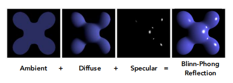
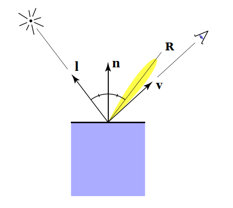

+++
title = 'Lighting'
date = 2025-02-22T13:38:09+08:00
draft = false
+++

# Lighting

## Phong
$$L = L_{a} + L_{d} + L_{s}$$

<center>



</center>

### 环境光（Ambient）
环境光也称间接光，是光线经过周围环境表面多次反射后形成的，利用它可以描述一块区域的亮度，在光照模型中，通常用一个常量来表示。

### 漫反射（Diffuse）
兰伯特余弦定律(Lambert Consine Law)中指出漫反射的大小取决于表面法线和光线的夹角，当夹角越大时，漫反射分量越小，当夹角接近90度时，我们认为漫反射几乎为零。
$$L_d = k_d(I/r^2)max(0, n \cdot L)$$

### 高光反射（Specular）
Phong模型认为高光反射的强度与反射光线R和观察角度v之间夹角的余弦值成正比
$$L_s = k_s(I/r^2)max(0, v \cdot R)^n$$
<center>



</center>

```glsl
#version 330 core
out vec4 FragColor;

in vec3 Normal;  
in vec3 FragPos;  
  
uniform vec3 lightPos; 
uniform vec3 viewPos; 
uniform vec3 lightColor;
uniform vec3 objectColor;

void main()
{
    // ambient
    float ambientStrength = 0.1;
    vec3 ambient = ambientStrength * lightColor;
  	
    // diffuse 
    vec3 norm = normalize(Normal);
    vec3 lightDir = normalize(lightPos - FragPos);
    float diff = max(dot(norm, lightDir), 0.0);
    vec3 diffuse = diff * lightColor;
    
    // specular
    float specularStrength = 0.5;
    vec3 viewDir = normalize(viewPos - FragPos);
    vec3 reflectDir = reflect(-lightDir, norm);  
    float spec = pow(max(dot(viewDir, reflectDir), 0.0), 32);
    vec3 specular = specularStrength * spec * lightColor;  
        
    vec3 result = (ambient + diffuse + specular) * objectColor;
    FragColor = vec4(result, 1.0);
} 
```

## Blinn-Phong

## PBR

## 辐射度量学

渲染方程$$L_o(p,\omega_o) = \int\limits_{\Omega} f_r(p,\omega_i,\omega_o) L_i(p,\omega_i) n \cdot \omega_i  d\omega_i$$

Cook-Torrance BRDF
$$f_r = k_df_{lambert} + k_sf_{cook-torrance}$$
$$f_{lambert} = \frac{c}{\pi}$$
$$f_{cook-torrance} = \frac{DFG}{4(\omega_0 \cdot n)(\omega_i \cdot n)}$$

粗略可以这么理解
> $D$：法线分布函数（对应镜面的高光部分）  
> $F$：菲涅尔方程（菲涅尔方程描述的是在不同的表面角下表面所反射的光线所占的比率， 体现了光在物体粗糙面上反射时的损耗）  
> $G$：几何函数（返回未被遮蔽的表面的百分比，代表几何遮蔽部分）  
> $\omega_i$：入射光线  
> $\omega_o$：视线  

> 为什么要除以$\pi$

### 法线分布函数

### 菲涅尔方程

### 几何函数

```glsl
#version 330 core
out vec4 FragColor;
in vec2 TexCoords;
in vec3 WorldPos;
in vec3 Normal;

// material parameters
uniform vec3 albedo;
uniform float metallic;
uniform float roughness;
uniform float ao;

// lights
uniform vec3 lightPositions[4];
uniform vec3 lightColors[4];

uniform vec3 camPos;

const float PI = 3.14159265359;
// ----------------------------------------------------------------------------
float DistributionGGX(vec3 N, vec3 H, float roughness)
{
    float a = roughness*roughness;
    float a2 = a*a;
    float NdotH = max(dot(N, H), 0.0);
    float NdotH2 = NdotH*NdotH;

    float nom   = a2;
    float denom = (NdotH2 * (a2 - 1.0) + 1.0);
    denom = PI * denom * denom;

    return nom / denom;
}
// ----------------------------------------------------------------------------
float GeometrySchlickGGX(float NdotV, float roughness)
{
    float r = (roughness + 1.0);
    float k = (r*r) / 8.0;

    float nom   = NdotV;
    float denom = NdotV * (1.0 - k) + k;

    return nom / denom;
}
// ----------------------------------------------------------------------------
float GeometrySmith(vec3 N, vec3 V, vec3 L, float roughness)
{
    float NdotV = max(dot(N, V), 0.0);
    float NdotL = max(dot(N, L), 0.0);
    float ggx2 = GeometrySchlickGGX(NdotV, roughness);
    float ggx1 = GeometrySchlickGGX(NdotL, roughness);

    return ggx1 * ggx2;
}
// ----------------------------------------------------------------------------
vec3 fresnelSchlick(float cosTheta, vec3 F0)
{
    return F0 + (1.0 - F0) * pow(clamp(1.0 - cosTheta, 0.0, 1.0), 5.0);
}
// ----------------------------------------------------------------------------
void main()
{		
    vec3 N = normalize(Normal);
    vec3 V = normalize(camPos - WorldPos);

    // calculate reflectance at normal incidence; if dia-electric (like plastic) use F0 
    // of 0.04 and if it's a metal, use the albedo color as F0 (metallic workflow)    
    vec3 F0 = vec3(0.04); 
    F0 = mix(F0, albedo, metallic);

    // reflectance equation
    vec3 Lo = vec3(0.0);
    for(int i = 0; i < 4; ++i) 
    {
        // calculate per-light radiance
        vec3 L = normalize(lightPositions[i] - WorldPos);
        vec3 H = normalize(V + L);
        float distance = length(lightPositions[i] - WorldPos);
        float attenuation = 1.0 / (distance * distance);
        vec3 radiance = lightColors[i] * attenuation;

        // Cook-Torrance BRDF
        float NDF = DistributionGGX(N, H, roughness);   
        float G   = GeometrySmith(N, V, L, roughness);      
        vec3 F    = fresnelSchlick(clamp(dot(H, V), 0.0, 1.0), F0);
           
        vec3 numerator    = NDF * G * F; 
        float denominator = 4.0 * max(dot(N, V), 0.0) * max(dot(N, L), 0.0) + 0.0001; // + 0.0001 to prevent divide by zero
        vec3 specular = numerator / denominator;
        
        // kS is equal to Fresnel
        vec3 kS = F;
        // for energy conservation, the diffuse and specular light can't
        // be above 1.0 (unless the surface emits light); to preserve this
        // relationship the diffuse component (kD) should equal 1.0 - kS.
        vec3 kD = vec3(1.0) - kS;
        // multiply kD by the inverse metalness such that only non-metals 
        // have diffuse lighting, or a linear blend if partly metal (pure metals
        // have no diffuse light).
        kD *= 1.0 - metallic;	  

        // scale light by NdotL
        float NdotL = max(dot(N, L), 0.0);        

        // add to outgoing radiance Lo
        Lo += (kD * albedo / PI + specular) * radiance * NdotL;  // note that we already multiplied the BRDF by the Fresnel (kS) so we won't multiply by kS again
    }   
    
    // ambient lighting (note that the next IBL tutorial will replace 
    // this ambient lighting with environment lighting).
    vec3 ambient = vec3(0.03) * albedo * ao;

    vec3 color = ambient + Lo;

    // HDR tonemapping
    color = color / (color + vec3(1.0));
    // gamma correct
    color = pow(color, vec3(1.0/2.2)); 

    FragColor = vec4(color, 1.0);
}

```

Albedo（反照率）
Metallic（金属度）
Roughness（粗糙度）
AO（环境光遮蔽）

## IBL（Image based lighting）
是一类光照技术的集合。其光源不是如前一节教程中描述的可分解的直接光源，而是将周围环境整体视为一个大光源
将周围环境视为一个大光源

需要解决的问题：
1. 多光源下，需要给定任意方向向量$w_i$，我们需要一些方法来获取这个方向上场景的辐射度 
2. 解决积分需要快速且实时


### HDR
等距圆柱投影转换为立方体贴图
```glsl
#version 330 core
out vec4 FragColor;
in vec3 WorldPos;

uniform sampler2D equirectangularMap;

const vec2 invAtan = vec2(0.1591, 0.3183);
vec2 SampleSphericalMap(vec3 v)
{
    vec2 uv = vec2(atan(v.z, v.x), asin(v.y));
    uv *= invAtan;
    uv += 0.5;
    return uv;
}

void main()
{		
    vec2 uv = SampleSphericalMap(normalize(WorldPos));
    vec3 color = texture(equirectangularMap, uv).rgb;
    
    FragColor = vec4(color, 1.0);
}
```
对于 IBL，假设$p$处于环境贴图中心，此时积分只依赖于$\omega_i$,此时可近似为
$$L_o(p,\omega_o) = L_d(\omega_o) + L_s(\omega_o)$$
对于实时渲染，需要分别预计算漫反射项和镜面项

漫反射积分项
$$L_o(p,\omega_o) = k_d\frac{c}{\pi} \int\limits_{\Omega} L_i(p,\omega_i) n \cdot \omega_i  d\omega_i$$
此时的积分项只取决于不同的$n$

<center>


</center>

镜面反射积分项
$$
L_o(p,\omega_o) = 
		\int\limits_{\Omega} (k_s\frac{DFG}{4(\omega_o \cdot n)(\omega_i \cdot n)}
			L_i(p,\omega_i) n \cdot \omega_i  d\omega_i
			=
		\int\limits_{\Omega} f_r(p, \omega_i, \omega_o) L_i(p,\omega_i) n \cdot \omega_i  d\omega_i
$$
近似处理后可以表示为
$$
L_o(p,\omega_o) = 
		\int\limits_{\Omega} L_i(p,\omega_i) d\omega_i
		*
		\int\limits_{\Omega} f_r(p, \omega_i, \omega_o) n \cdot \omega_i d\omega_i
$$
第一部分为预滤波环境贴图，第二部分为BRDF积分贴图